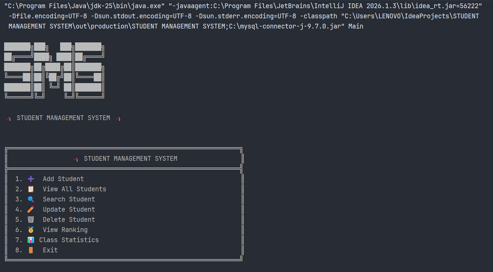
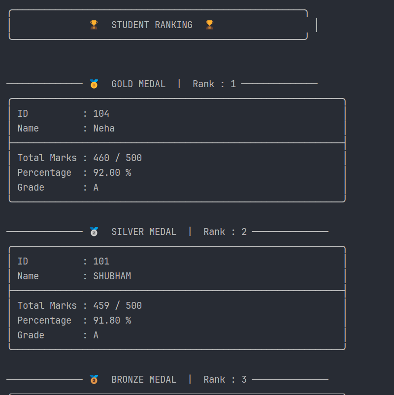
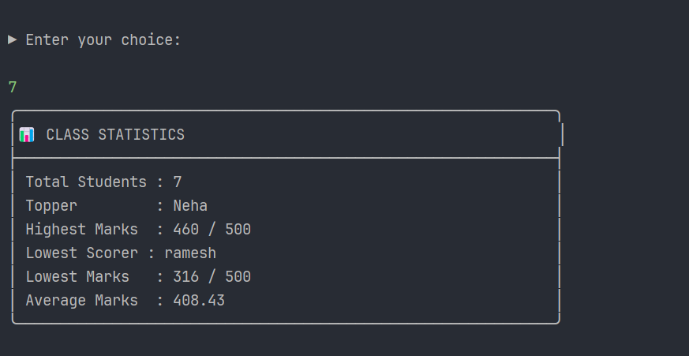

# 📚 Student Management System (Java)


A Java console-based **Student Management System** built using **Java, JDBC, and MySQL**. This project demonstrates **Object-Oriented Programming (OOP)**, **CRUD operations**, **JDBC connectivity**, **exception handling**, **input validation**, and a **professional console-based UI** with persistent database storage.

---

## 🎥 Project Demo

<p align="center">
  
</p>

---

## ✨ Features

- ➕ Add Student
- 📋 View All Students
- 🔍 Search Student by ID
- ✏️ Update Student Details
- 🗑️ Delete Student
- 🏆 Student Ranking
- 📊 Class Statistics
- 💾 Persistent Data Storage using MySQL
- ⚠️ Input Validation & Exception Handling
- 🎨 Professional Console-Based UI

---

## 🛠️ Tech Stack

<p align="left">
  
</p>

**Java • JDBC • MySQL • SQL • Git • GitHub • IntelliJ IDEA**

---

## 📚 Concepts Used

- ✔️ Object-Oriented Programming (OOP)
- ✔️ JDBC API
- ✔️ CRUD Operations
- ✔️ PreparedStatement
- ✔️ Try-with-Resources
- ✔️ Exception Handling
- ✔️ Input Validation
- ✔️ ArrayList
- ✔️ Sorting using Comparator
- ✔️ Basic Statistics (Highest, Lowest & Average)

---

## ▶️ How to Run

1. Clone this repository.

```bash
git clone https://github.com/dev-jshubham/student-management-system.git
```

2. Open the project in IntelliJ IDEA (or any Java IDE).

3. Install and start MySQL Server.

4. Execute the `database.sql` script.

5. Copy `DBConnectionExample.java` and rename it to `DBConnection.java`.

6. Update the following values:

- Database URL
- Username
- Password

7. Add the MySQL JDBC Driver (JAR or Maven Dependency).

8. Run `Main.java`.

> **Note**
>
> `DBConnection.java` is intentionally excluded from this repository because it contains private database credentials. Use `DBConnectionExample.java` as a template.

---

## ✅ Project Status

**✔ Project Completed**

This project successfully implements a complete **Student Management System** using **Java, JDBC, and MySQL** with persistent database storage, ranking, class statistics, and a clean console interface.

---

## 📁 Project Structure

```text
STUDENT-MANAGEMENT-SYSTEM/
│
├── src/
│   ├── Main.java                 # Application entry point
│   ├── Manager.java              # Business logic & CRUD operations
│   ├── Student.java              # Student model
│   └── DBConnectionExample.java  # Database connection template
│
├── database.sql                  # Database schema
├── screenshots/                  # Project screenshots & demo GIF
├── .gitignore
└── README.md
```

---

## 📸 Screenshots

### 🏠 Main Menu



---

### ➕ Add Student


---

### 📋 View Students


---

### 🔍 Search Student


---

### ✏️ Update Student


---

### 🗑️ Delete Student


---

### 🏆 Student Ranking



---

### 📊 Class Statistics



---

## 🎯 Learning Outcomes

Through this project, I practiced:

- Java Object-Oriented Programming (OOP)
- JDBC Connectivity
- MySQL Database Integration
- CRUD Operations
- Exception Handling
- Input Validation
- SQL & PreparedStatement
- Collection Framework (ArrayList)
- Sorting using Comparator
- Console UI Design
- Git & GitHub Project Management

---

## 🚀 Future Improvements

Some features that can be added in future versions:

- 🔐 Login & Authentication
- 📂 Export Student Data (CSV/PDF)
- 📈 Subject-wise Statistics
- 📌 Search by Name
- 🌐 JavaFX or Swing GUI
- 🌱 Spring Boot REST API Version

---

## 👨‍💻 Author

**Shubham Joshi**

🎓 BCA Student | Aspiring Java Backend Developer

🔗 **GitHub:**  
https://github.com/dev-jshubham

📂 **Repository:**  
https://github.com/dev-jshubham/student-management-system

---

⭐ **If you found this project helpful, consider giving it a star!**