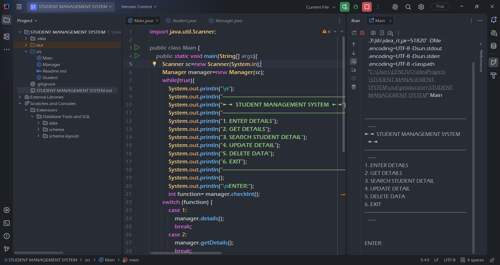
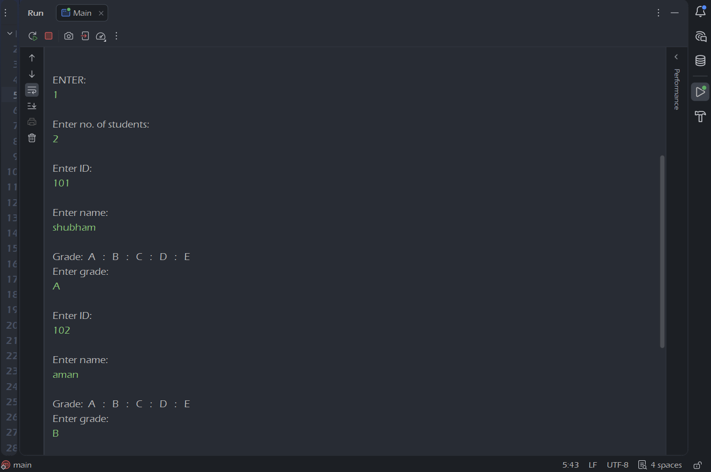
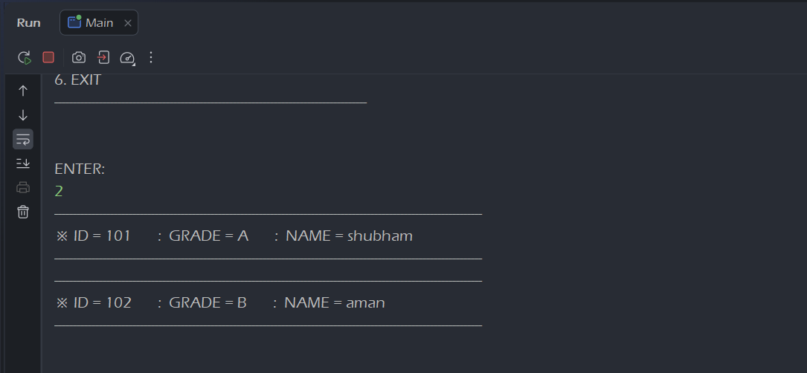
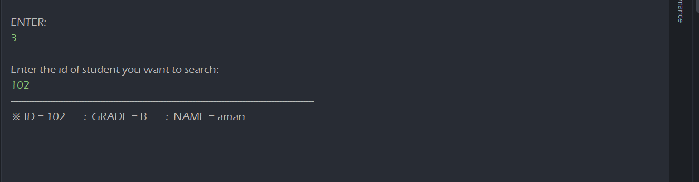
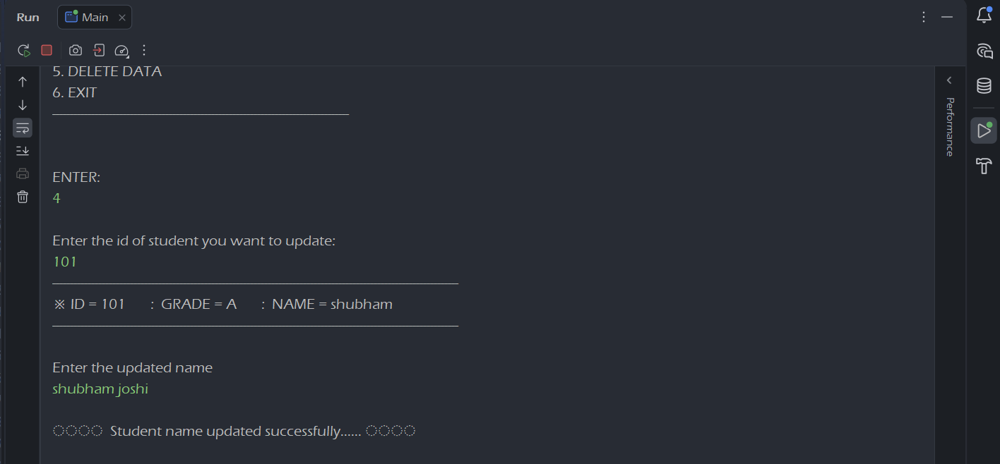
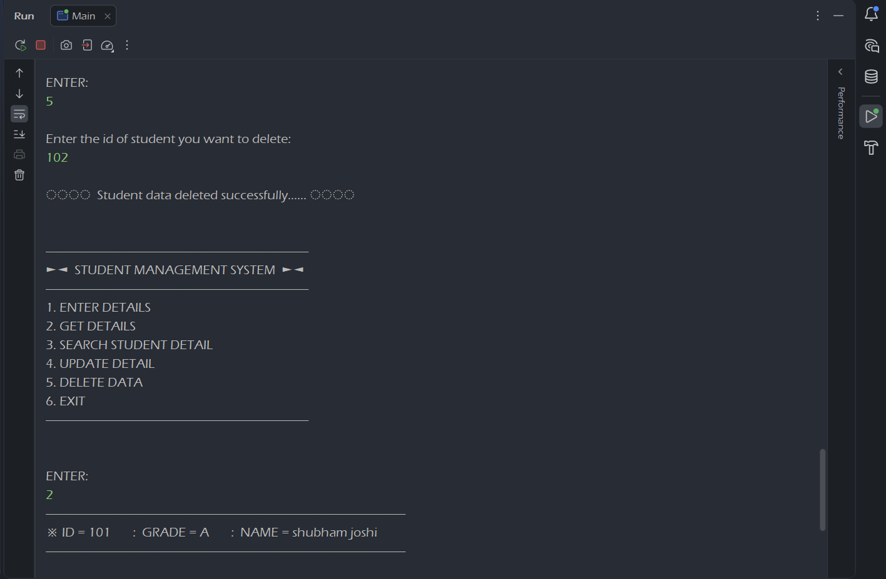

# 📚 Student Management System (Java)


A Java console-based Student Management System that demonstrates Object-Oriented Programming (OOP), Collections (ArrayList), and Exception Handling through CRUD (Create, Read, Update, Delete) operations.

---

## 🚀 Features
- ➕ Add Student
- 📋 View Students
- ❌ Delete Student
- 🔍 Search Student 
- ✏️ Update Student Data

---

## 🛠️ Tech Stack
- Java
- OOP Concepts
- Collections (ArrayList)
- Exception Handling
- IntelliJ IDEA
---
## ▶️ How to Run

1. Clone the repository.
2. Open the project in IntelliJ IDEA  or other code editor.
3. Run `Main.java`.
---
## 🚧 Project Roadmap

- ✅ Stage 1: Core CRUD using ArrayList (Completed)
- ⏳ Stage 2: Additional Features
- ⏳ Stage 3: JDBC + MySQL Database Integration

---
## 📁 Project Structure
```text
Student-Management-System/
│
├── screenshots/
├── src/
│   ├── Main.java
│   ├── Student.java
│   ├── Manager.java
│   
|── README.md
├── .gitignore
|── .idea/ (ignored)
|── *.iml (ignored)
```
---

## 📸 Screenshots

### 🏠 Main Menu



### ➕ Add Student


### 📋 View Students


### 🔍 Search Students


### 📝 Update Students data


### 🗑️ Delete Students


---


## 👨‍💻 Author

Shubham Joshi  

GitHub Profile: https://github.com/dev-jshubham

Project Repository: https://github.com/dev-jshubham/student-management-system